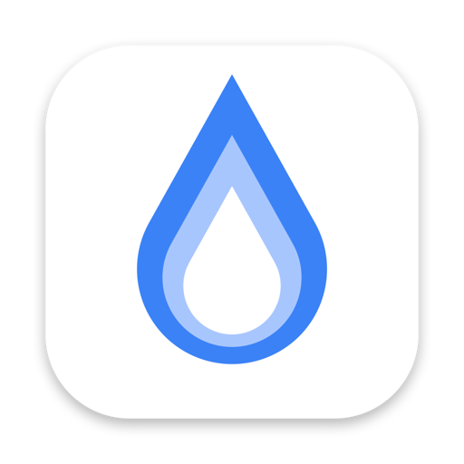
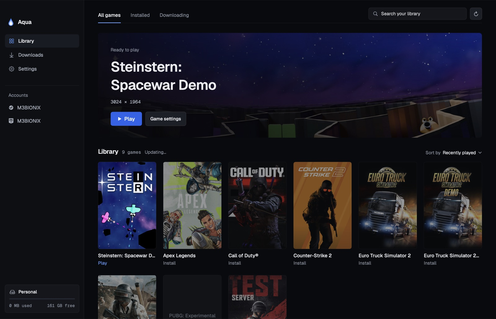
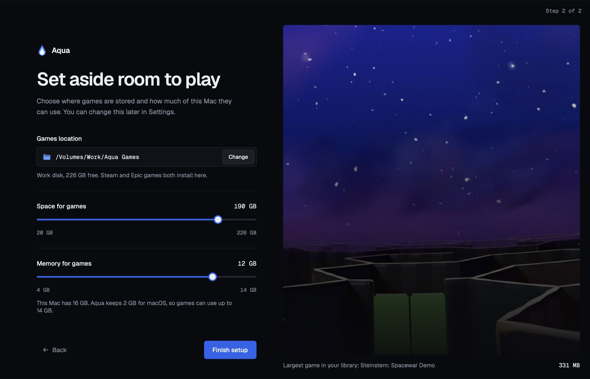
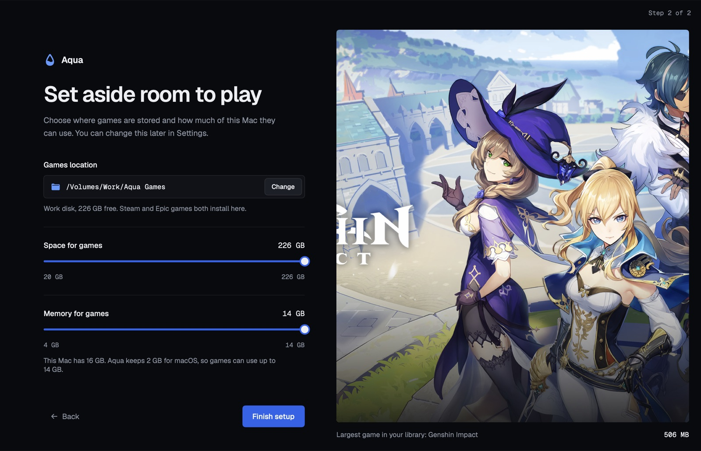

<p align="center">
  
</p>

<h1 align="center">Aqua</h1>

<p align="center">
  Play the Windows games you own on Steam and Epic Games on your Mac. Free and open source.
</p>

<p align="center">
  <a href="https://github.com/M3BIONIX/Aqua/releases">Download</a> |
  <a href="#build">Build</a> |
  <a href="#what-works">What works</a> |
  <a href="#how-it-works">How it works</a> |
  <a href="https://github.com/M3BIONIX/Aqua/issues">Report a game</a>
</p>

---

> **If your game didn't work, I'm really sorry.** If you downloaded a game, tried to play it with
> Aqua and it didn't run, please [open an issue](https://github.com/M3BIONIX/Aqua/issues) with the
> game's name and what happened. I'll look into it within a couple of days. I probably won't have the
> money to buy every game, but I'll find a way to test it, ship a fix, and update you on the issue.

<p align="center">
  
</p>

## Why Aqua

I saw a paid app that runs Windows games on a Mac, and it honestly pissed me off that it was paid.
Running Windows games on a Mac is built on years of free, open work by the Wine, DXVK and DXMT
communities. So I decided to build an open source version. That's it.

The code is probably not great, so please don't judge me on it. If you spot something that could be
better, open a pull request. Fixes are very welcome.

## What works

- **Good for playing games**, as long as they don't use kernel anti-cheat.
- **Valorant won't work**, because of its anti-cheat. The same goes for other games with kernel
  anti-cheat (Easy Anti-Cheat or BattlEye online modes, Vanguard and similar).
- **Counter-Strike 2 and PUBG are untested.** I don't know yet whether they run.
- **I've only tested small games so far**, such as Steinstern: Spacewar Demo and Spacewar on Steam, and
  Genshin Impact's launcher from Epic. Bigger games are next, and I hope to keep improving this.

If you try a game, tell me how it went in the [issues](https://github.com/M3BIONIX/Aqua/issues),
whether it worked or not. That's how the list above grows.

## Features

- **One library.** Sign in to Steam, Epic Games or both, and every game you own shows up in one grid.
  Sign-ins stay saved.
- **Games from anywhere else.** Add a Windows game that isn't on Steam or Epic (a DRM-free
  download from GOG or itch.io, an old disc): run its installer, or point Aqua at the game's `.exe`.
  Aqua finds cover art for it and it shows up in the same library.
- **Install and play from Aqua.** Aqua sets up its Windows engine and Steam for you, so there is
  nothing else to install.
- **Downloads you can control.** Pause, resume, reorder and cancel downloads from both stores, with a
  live network monitor.
- **Your Mac, your limits.** Choose where games are stored, how much disk space they can use, and how
  much memory they get.
- **Sharp graphics.** Games can render at your display's full Retina resolution.

<p align="center">
  
  
</p>

## Install

**You need:** an Apple Silicon Mac (M1 or later) with macOS 14 Sonoma or later.

### The easy way (recommended)

Open Terminal and paste this:

```sh
curl -fsSL https://raw.githubusercontent.com/M3BIONIX/Aqua/main/install.sh | bash
```

That's it. It downloads the latest release, checks it against its SHA-256 checksum, installs Rosetta 2
if you don't have it, puts Aqua in Applications and opens it. Run the same command again to update.

**Why not just a normal download?** Apple charges $99 a year to sign and notarize Mac apps, and I'm
poor. Without that, macOS shows *"Apple could not verify 'Aqua' is free of malware"* when you open a
downloaded DMG. Apps installed with the command above aren't flagged as downloaded from a browser, so
that warning never shows up. You can read [`install.sh`](install.sh) before running it; it's short.

### With the DMG

If you'd rather download it yourself:

1. Install Rosetta 2 if you haven't already. Open Terminal and run:

   ```sh
   softwareupdate --install-rosetta --agree-to-license
   ```

2. Download `Aqua-<version>.dmg` from the latest [release](https://github.com/M3BIONIX/Aqua/releases/latest).
3. Open the DMG and drag `Aqua` onto the `Applications` folder next to it.
4. Open Aqua. Because it isn't notarized, macOS shows the "Apple could not verify" warning the first
   time. Click **Done**, then:
   - open **System Settings → Privacy & Security**,
   - scroll down to the message about Aqua and click **Open Anyway**,
   - confirm with **Open Anyway** and your password.

   Or remove the warning with one Terminal command, then open Aqua normally:

   ```sh
   xattr -dr com.apple.quarantine /Applications/Aqua.app
   ```

### First launch

Sign in to Steam, Epic Games or both, then choose where games go and how much disk space and memory
they can use. Aqua downloads its Wine engine and graphics layers in the background (about 160 MB, one
time, each file checked against a pinned SHA-256).

Your sign-ins, settings and games are kept in `~/Library/Application Support/Aqua` and your games
folder, so updating Aqua keeps them.

To uninstall, quit Aqua, delete it from Applications, and delete `~/Library/Application Support/Aqua`
plus your games folder if you no longer want the games.

## Build

Requires Xcode.

```sh
scripts/build-app.sh          # builds build/Aqua.app
scripts/make-dmg.sh           # packages it as build/Aqua.dmg
swift test                    # unit tests (set DEVELOPER_DIR to Xcode if needed)
swift build --product aqua-cli
```

### CLI

The CLI uses the same core as the app:

```sh
aqua-cli doctor
aqua-cli setup                      # Wine runtime
aqua-cli steam install | open | games | play <appid> | stop
aqua-cli epic login [code] | status | games | install <app> | play <app> | stop
aqua-cli local install <setup.exe> | add <game.exe> [name] | list | play <name> | remove <name>
aqua-cli recipe steam 730
```

`AQUA_HOME=/some/folder` keeps all of Aqua's data in another folder, for testing.

## How it works

| Layer | Component |
|---|---|
| CPU | Rosetta 2 (x86_64 Wine on Apple Silicon) |
| Windows API | Aqua Wine: CrossOver 26.3 / Wine 11 built from source (Sikarugir Wine 10 and CrossOver 24 as fallbacks) |
| DirectX 11/12 to Metal | Apple D3DMetal |
| DirectX 10/11 to Metal | DXMT |
| DirectX 9-11 to Vulkan to Metal | DXVK with the KosmicKrisp Vulkan driver |
| Fallback | WineD3D (OpenGL) |

- **Steam:** the official Windows Steam client runs in its own Wine environment (a "bottle"). Aqua
  reads the library and drives installs and downloads through the running client.
- **Epic:** [legendary](https://github.com/derrod/legendary) handles sign-in, the library, downloads
  and launch tokens. Aqua runs the game through its own Wine.
- **Per-game fixes** live in data (`Sources/AquaCore/Resources/recipes.json`), not code.

### Engine

Aqua's default engine is built from CodeWeavers' CrossOver 26.3 source (Wine 11) plus the patches in
`Engine/patches/`:

1. Renderer DLLs (D3DMetal, DXMT) are searched before Wine's own.
2. Steam's browser runs single-process, so its UI isn't a black window.
3. Games are told the memory limit you chose (`AQUA_MEMORY_LIMIT_MB`).
4. `NtQueryDirectoryObject` reads only the defined byte of its BOOLEAN arguments, so games that
   enumerate system objects at startup (Hogwarts Legacy) don't loop forever.
5. 32-bit programs can't reserve a block larger than Windows would give them (0x7fff0000 bytes), so
   FreeArc-based repack installers don't spin at 0% probing memory.
6. `D3DKMTOpenAdapterFromHdc` opens the primary display's adapter instead of failing, so games that
   look up their GPU this way (Need for Speed: The Run) start.

```sh
Engine/build-engine.sh        # about 10 minutes on Apple Silicon, produces aqua-wine-cx26.3.0-r<N>.tar.xz
```

The archive is published as a release asset and pinned in `RuntimeComponents.aquaEngine`. Sikarugir's
Wine 10 and CrossOver 24 builds remain available per game (`"engine"` in a recipe). Each engine gets
its own bottle.

### Display

- **Retina resolution** (setting): Wine renders at full pixel resolution with 200% Windows scaling.
- **Display recipes** write a game's own settings file at the display's resolution before launch
  (3024 × 1964 on a 14" MacBook Pro), so the game draws every pixel.
- **Games location** appears in every bottle as drive **S:**. Steam's library is `S:\SteamLibrary`;
  Epic games install to `<location>/Epic`.

### Recipes

```json
"steam:489830": { "renderer": "dxmt", "notes": "Skyrim SE" },
"epic:Fortnite": { "renderer": "d3dmetal", "windowsVersion": "win10", "environment": { "X": "1" },
                   "dllOverrides": { "d3d12": "" }, "arguments": ["-dx11"] }
```

You can add your own recipes in `~/Library/Application Support/Aqua/recipes.json`; they override the
bundled file. Choosing a renderer on a game's page writes there.

## Known limits

- Games with kernel anti-cheat won't run online under Wine.
- Wine Mono (.NET) isn't bundled yet; .NET is turned off so Wine doesn't ask to download it.
- Genshin Impact's launcher (HoYoPlay) only renders on the CrossOver 24 engine so far, which its
  recipe selects.
- Steam shader pre-compilation isn't implemented; shader caches are kept per bottle.
- There's no download speed limit: legendary has none, and Steam's can only be set inside Steam.
- The memory limit is what games are told, not a hard cap. macOS has no per-app memory ceiling.

## Contributing

Issues and pull requests are welcome, especially:
- reports of games that do or don't work (include your Mac model and macOS version),
- recipes that make a game run,
- cleanups of my code.

## Licenses

Aqua is MIT licensed (see `LICENSE`).

- **Wine:** LGPL-2.1. Aqua's engine patches in `Engine/patches/` are under the same license, and the
  engine is built from CodeWeavers' published CrossOver source.
- **DXMT and DXVK:** MIT and zlib.
- **legendary:** GPLv3. It is downloaded at first run and runs as a separate program.
- **D3DMetal:** Apple's. It is downloaded from the Sikarugir project at setup and never bundled.
- **Geist and Geist Mono fonts:** SIL Open Font License (`Sources/Aqua/Resources/Fonts/OFL-Geist.txt`).
